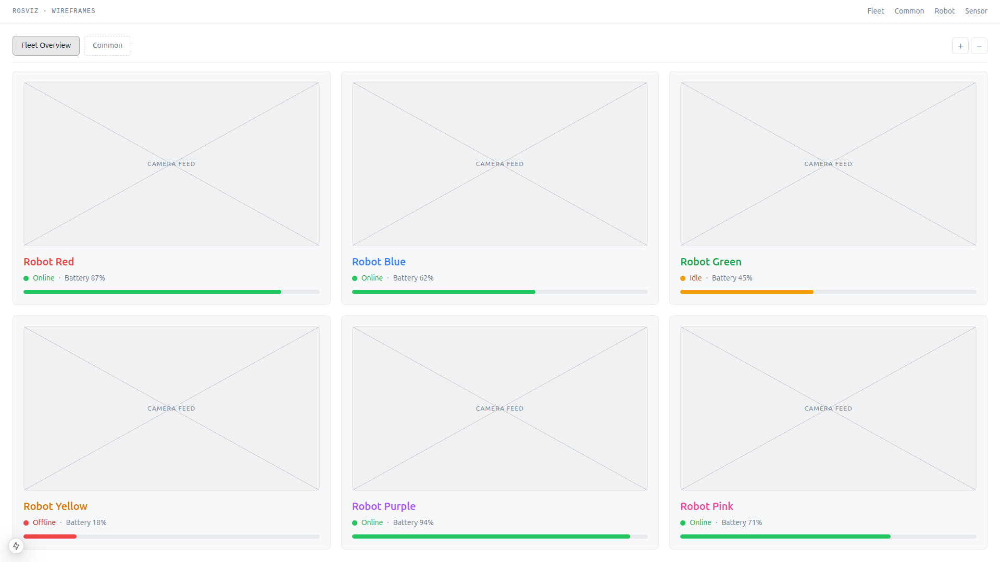
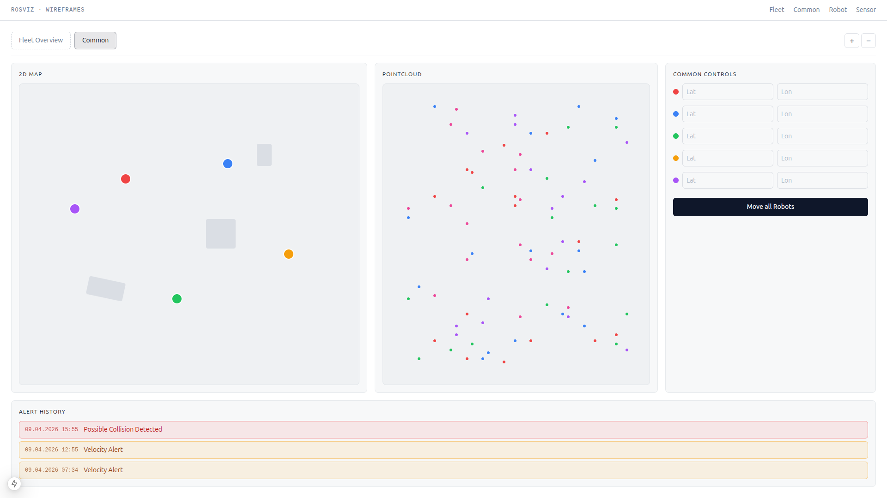
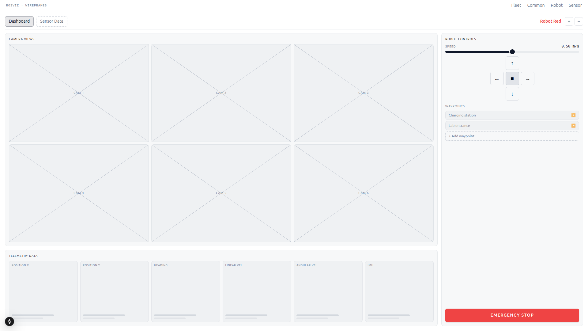
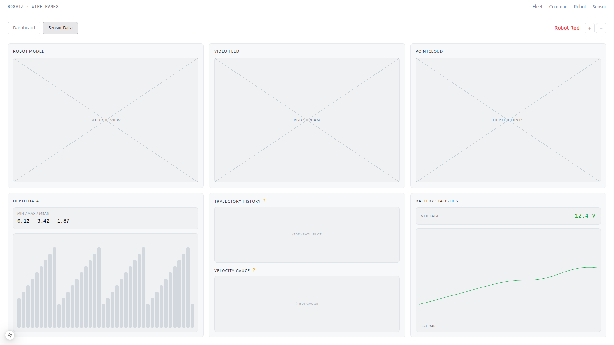

# ROSViz Web — Wireframes

Design mockups for the planned multi-robot fleet redesign. Each screen lives under `src/app/wireframes/` and is a static Next.js page — no rosbridge, no live data. Open the project with `docker compose up --build` (or `npm run dev` locally) and browse the routes below.

## Fleet Overview — `/wireframes/fleet`

Top-level grid of all connected robots, with a quick look at each one's camera, status and battery.

## Common Tab — `/wireframes/common`

Cross-robot view: shared 2D map, multi-colour pointcloud, per-robot lat/lon controls and a global alert history.

## Single-Robot Dashboard — `/wireframes/robot`

Primary driving screen: 6-tile camera grid, 6-card telemetry, and a controls column with speed slider, D-pad, waypoints and emergency stop.

## Single-Robot Sensor Data — `/wireframes/sensor`

Sensor-focused view: robot model, RGB video, pointcloud, depth chart, TBD trajectory / velocity gauges and battery stats.

